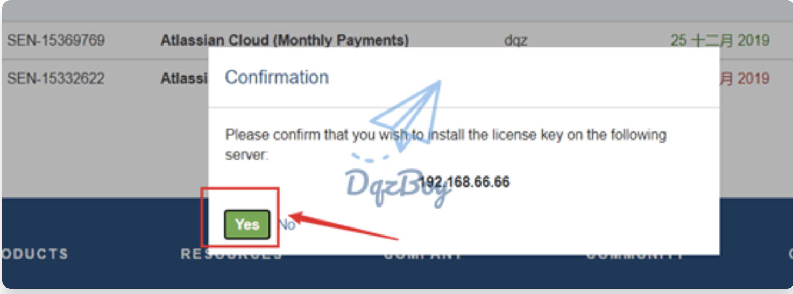
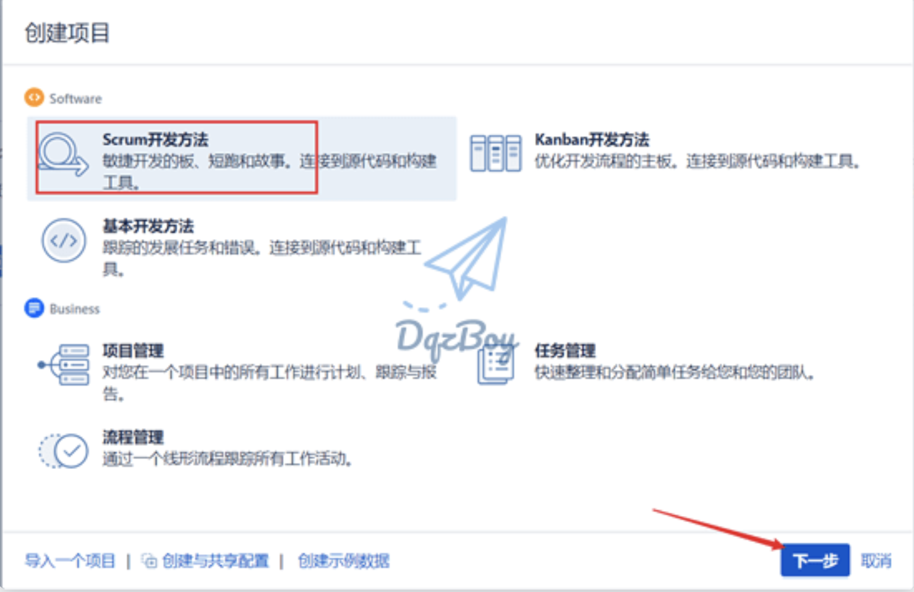

# JIRA 本地安装

# 下载安装包 (mysql 5.7/Jira 8.5.8)
下载[安装包](https://www.atlassian.com/software/jira/download) 或者在 [\\\\192.168.0.150\工具\JIRA](#) 下复制安装包

## 下载 JIRA
使用链接[JIRA](https://www.atlassian.com/software/jira/download)

## 安装 JDK 8
略

## 安装 MySQL
### 设置root用户权限密码
```sql
mysql> ALTER USER 'root'@'localhost' IDENTIFIED BY 'abcd123456';
mysql> CREATE USER 'root'@'%' IDENTIFIED BY 'abcd123456';
mysql> grant all privileges on *.* to root@'%';
```

### 创建 JIRA 数据库
```sql
mysql> CREATE DATABASE jira CHARACTER SET utf8mb4 COLLATE utf8mb4_bin;
```

### JIRA 数据库权限设置
```sql
mysql> GRANT SELECT,INSERT,UPDATE,DELETE,CREATE,DROP,ALTER,INDEX on jira.* TO 'jira'@'%' IDENTIFIED BY 'abcd123456';
mysql> flush privileges;
```

## 安装JIRA
### 解压JIRA到<JIRA root>
比如把JIRA 压缩包解压到 d:\dev\atlassin-jira-software-8.5.8-standalone

### 修改应用端口避免和现有应用冲突
修改 d:\dev\atlassin-jira-software-8.5.8-standalone\conf\server.xml
* 替换 8080端口为5050

### 启动JIRA服务访问http://localhost:5050 进行配置

选择手动设置


数据库设置选择MySQL 5.6


在官网生成试用授权




设置管理员账户

跳过电子邮件通知

选择界面语言

选择头像

创建项目


选择工作流

给项目命名


### 覆盖jar包
将atlassian-extras-3.2.jar从 150机器拷贝至d:\dev\atlassin-jira-software-8.5.8-standalone\atlassian-jira\WEB-INF\lib下面

### 重启JIRA服务
检查授权时间已经延长


